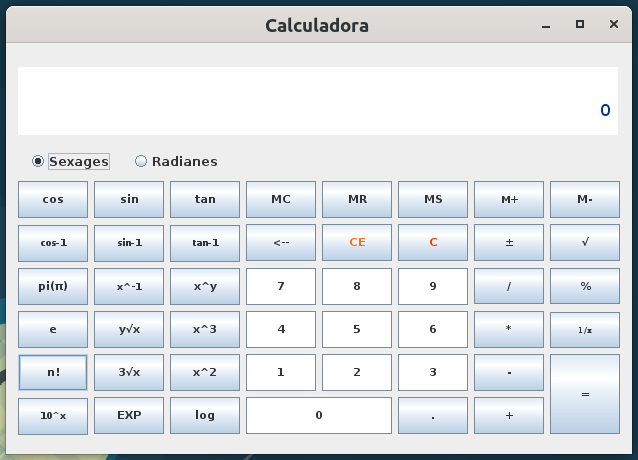

# Calculadora Científica

## Pasos para ejecutar la calculadora
- Tener instalado una version mayor o igual a java 1.8.
- Descargar el archivo
  - Hacer click en el boton verde "Clone or download".
  - Hacer click en el boton "Download ZIP"
- Descomprimir el archivo
- Ubicarse en la carpeta target
- Ejecutar desde el cmd el archivo calculadora-1.0-SNAPSHOT.jar
<code>$ java -jar calculadora-1.0-SNAPSHOT.jar</code>
